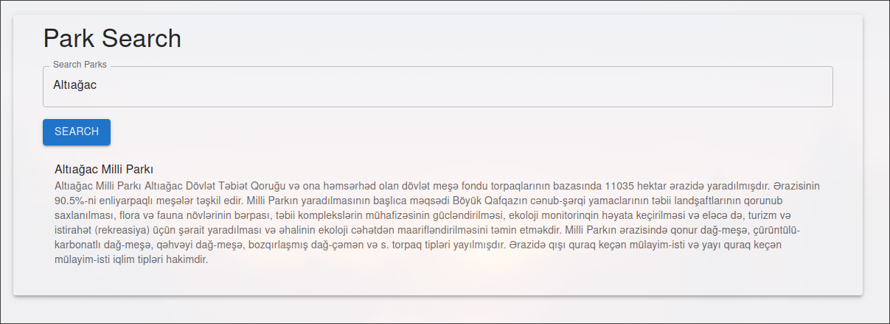

# GreenGeo Project

## Overview

GreenGeo is a comprehensive project aimed at providing geospatial analysis and visualization tool for **National Parks in Azerbaijan**.

## Installation

To install the GreenGeo project, follow these steps:

```sh
git clone https://github.com/yourusername/GreenGeo.git

cd GreenGeo

cd vg-api
bun install
bun run 
cd ..

docker compose up -d
```

## Packages

The GreenGeo monorepo consists of the following packages:

### `virtual-guide`

A **ReactJS** front end that takes geoJSON objects from API(**vg-api**) and visualize with **Openlayers**.

### `vg-api`

An **ElysiaJS** back end that allows managing geoJSON data, and enrich them.

### DB

Database is **MongoDB**.

### Sample Data

The data provided in `parks.json` is manually parsed from `eco.gov.az`. `geojson.io` Web App was used for this purpose. It allows creating **GeoJSON** data.

## Flow

### Tourist

- Interactive Map with Park boundaries, Trails, Icons and Legend.
- Information about **National Parks**.

### National Park Owner

- Goes to `geojson.io` and prepares **the Map Layer**
- Goes to **API** (Further can converted to Admin Dashboard), and creates a Park with certain endpoint.
- Then Map is visualized on the Frontend too.

## FrontEnd Gallery

### Home Page


---


---

### Park Page


---


---

### Search Page



### Other


---

## Backend Gallery


---

## `geojson.io`


